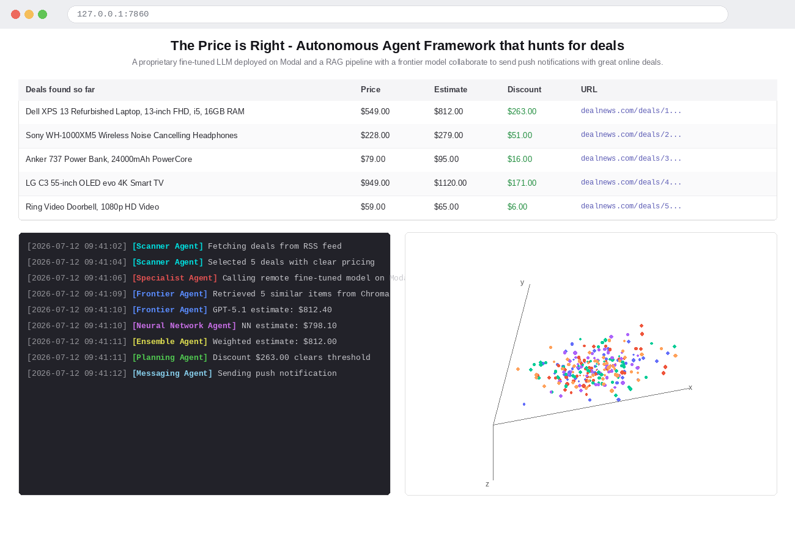
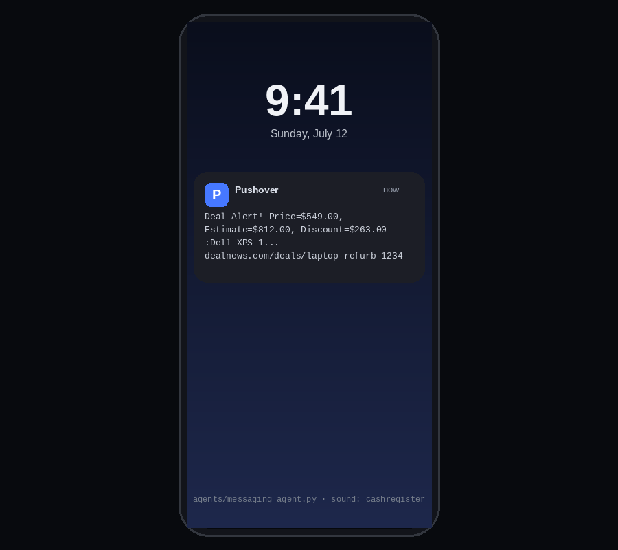

# Agentic AI Price Prediction Capstone 🕵️‍♂️💸

A multi-agent AI system that autonomously scans deal feeds, estimates a product's "true" value with an ensemble of pricing models, and alerts you when it finds a bargain — priced well below its estimated worth.

## How it works

The system is built from a team of cooperating agents, coordinated by a **Planning Agent**:

1. **Scanner Agent** — pulls live deals from RSS feeds (DealNews electronics, computers, smart home), uses an LLM to pick the 5 best-described, most clearly-priced deals from the noise.
2. **Ensemble Agent** — estimates the *true* market value of each product by combining three independent pricing models:
   - **Specialist Agent** — a fine-tuned open-source LLM (from the companion price-predictor project) served remotely via **Modal**.
   - **Frontier Agent** — a frontier model (GPT-5.1) doing RAG-style price estimation, retrieving similar products from a **Chroma** vector store for context.
   - **Neural Network Agent** — a custom deep neural network trained directly on product embeddings.
   
   The three estimates are combined with fixed weights into a final price.
3. **Planning Agent** — compares the ensemble's estimate to the deal's listed price; if the discount clears a threshold, it becomes an "Opportunity."
4. **Messaging Agent** — sends a push notification (via Pushover) when a genuine bargain is found.
5. **Autonomous Planning Agent** — a more advanced planner that lets an LLM (GPT-5.1) decide for itself, via tool calling, when to scan for deals, when to estimate value, and when to notify — rather than following a fixed pipeline.

Everything is coordinated by `DealAgentFramework`, which persists deal history to `memory.json` and stores product embeddings in a local Chroma vector database for the RAG-based Frontier Agent.

## Application Preview

### Live Dashboard

<p align="center">
  
</p>

### Opportunity Notification

<p align="center">
  
</p>

## Files

| File / Folder | Description |
|---|---|
| `modal_specialist_agent.ipynb` | Sets up and deploys the fine-tuned pricing model as a remote service on Modal. |
| `rag_frontier_ensemble_agents.ipynb` | Builds the Chroma vector store, and develops the Frontier (RAG), Neural Network, and Ensemble agents. |
| `scanner_messaging_agents.ipynb` | Develops the deal-scanning and push-notification agents. |
| `autonomous_planning_agent.ipynb` | Develops the LLM-driven autonomous planner that decides its own next actions via tool calling. |
| `capstone_price_is_right_ui.ipynb` | Final end-to-end system wired into a Gradio UI. |
| `results_analysis.ipynb` | Analysis of pricing accuracy/results across agents. |
| `price_is_right.py` | Main Gradio application — a live dashboard showing incoming deals, agent activity logs, and a 3D t-SNE plot of the product vector space. |
| `deal_agent_framework.py` | Orchestration layer — initializes agents, persists deal memory (`memory.json`), manages the Chroma vector store, and provides t-SNE plot data. |
| `agents/agent.py` | Abstract base class providing consistent colored logging across all agents. |
| `agents/scanner_agent.py` | Fetches and filters deals from RSS feeds using an LLM. |
| `agents/frontier_agent.py` | RAG-based price estimator using a frontier model + Chroma similarity search. |
| `agents/specialist_agent.py` | Calls the fine-tuned pricing model running remotely on Modal. |
| `agents/neural_network_agent.py` / `agents/deep_neural_network.py` | Custom deep neural network for price inference from product embeddings. |
| `agents/ensemble_agent.py` | Combines Specialist, Frontier, and Neural Network estimates into a final weighted price. |
| `agents/planning_agent.py` | Fixed-pipeline planner: prices a deal and decides if it's a genuine opportunity. |
| `agents/autonomous_planning_agent.py` | LLM-driven planner that autonomously chooses which tools (scan / estimate / notify) to call and when. |
| `agents/messaging_agent.py` | Sends push notifications via Pushover when a bargain is found. |
| `agents/preprocessor.py` | Cleans/rewrites product descriptions before pricing. |
| `agents/deals.py` | Pydantic models for scraped deals and opportunities; RSS feed definitions and HTML-cleaning helpers. |
| `agents/items.py` | Shared product/item data model. |
| `pricer_service.py`, `pricer_service2.py`, `pricer_ephemeral.py` | Modal service definitions for hosting the fine-tuned pricing model remotely. |
| `llama.py` | Helper for loading/running the Llama-based specialist model. |
| `log_utils.py` | Formatting helpers for the live log display in the Gradio UI. |
| `requirements.txt` | Python dependencies for the project environment. |

## Key Concepts Covered

- **Multi-agent orchestration**: independent agents (scanning, pricing, planning, messaging) coordinated by a central framework
- **Ensemble modeling**: combining a fine-tuned LLM, a frontier LLM (RAG-based), and a neural network into a single weighted price estimate
- **RAG for price estimation**: retrieving similar products from a Chroma vector store to ground the frontier model's price guess
- **Remote model serving**: deploying a fine-tuned model as a scalable service with **Modal**
- **Agentic tool calling**: an LLM-driven planner (`AutonomousPlanningAgent`) that decides its own next action instead of following a hardcoded pipeline
- **Real-world data pipeline**: scraping and cleaning live deal data from RSS feeds with `feedparser` + `BeautifulSoup`
- **Persistent memory**: tracking discovered opportunities across runs via `memory.json`
- **Live monitoring UI**: a Gradio dashboard with streaming agent logs and a 3D t-SNE visualization of the product embedding space

## Setup

```bash
pip install -r requirements.txt
python price_is_right.py
```

This capstone integrates several external services — add the required credentials to a local `.env` file before running:
- `OPENAI_API_KEY` (Scanner, Frontier, and Autonomous Planning agents)
- `ANTHROPIC_API_KEY` (Messaging Agent, via `litellm`)
- Modal account/token (Specialist Agent — deploy `pricer_service.py` first)
- `PUSHOVER_USER` / `PUSHOVER_TOKEN` (push notifications)
- Hugging Face token (if loading models directly rather than via Modal)

Generated cache files, model checkpoints, `memory.json`, and the Chroma vector database (`products_vectorstore/`) are intentionally excluded from the repo so it stays clean for GitHub — you'll need to rebuild the vector store (via `rag_frontier_ensemble_agents.ipynb`) and deploy the Modal service before running the full pipeline.
